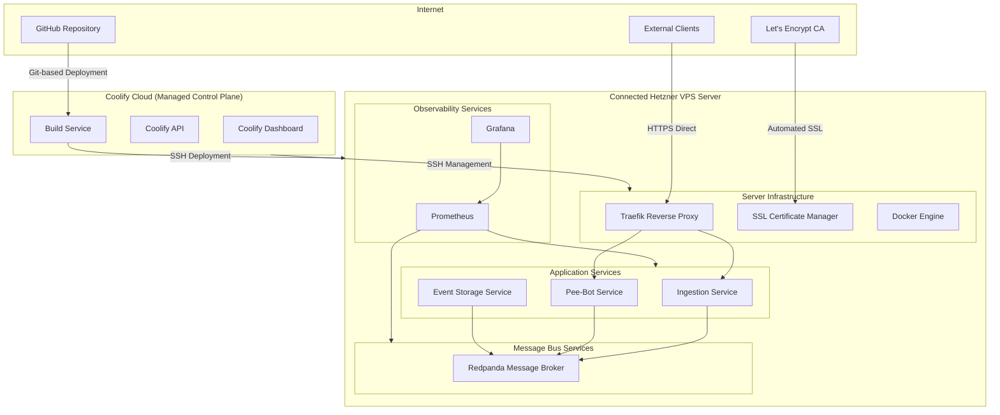

# DevOps Architecture - ISS Data Analytics System

## 1. Overview

### 1.1. Introduction

This document defines the complete DevOps architecture for the ISS Data Analytics System, a real-time telemetry platform deployed as a containerized microservices system. The architecture implements modern DevOps practices including Infrastructure as Code, CI/CD automation, containerization, and observability while leveraging Coolify Cloud as a managed control plane that orchestrates deployments to dedicated VPS infrastructure.

### 1.2. Architecture Principles

- **GitOps-Driven Deployment**: All deployments triggered from Git operations with comprehensive testing
- **Container-First**: All services deployed as Docker containers with health checks and auto-restart
- **Monorepo Structure**: Unified repository with workspace-based dependency management
- **Environment Parity**: Identical container images across staging and production environments
- **Observability by Design**: Built-in health checks, metrics, and logging for all services
- **Security by Default**: TLS termination, non-root containers, secret management, and vulnerability scanning

## 2. Infrastructure Architecture

### 2.1. High-Level Infrastructure Diagram



### 2.2. Platform Components

#### Coolify Cloud Control Plane
- **Role**: Managed control plane for deployment orchestration and monitoring
- **Features**: Git-based deployment, automated SSL certificate management, health monitoring, build services
- **Configuration**: SSH-based connection to Hetzner VPS, webhook triggers from Git repositories
- **Management**: Centralized dashboard for server deployment management and monitoring
- **Pricing**: $5/month base (2 servers) + $3/month per additional server

#### Connected Hetzner VPS Infrastructure
- **Provider**: Hetzner VPS (user-managed server)
- **Engine**: Docker Engine installed and managed on VPS by Coolify Cloud via SSH
- **Networking**: Traefik reverse proxy deployed on VPS, direct traffic routing (no proxy through Coolify)
- **Storage**: VPS-based storage with Docker volumes and bind mounts
- **Security**: SSH key authentication, non-root container execution, automatic security updates
- **Traffic Flow**: Client traffic goes directly to Hetzner VPS proxy, reducing latency and network hops

### 2.3. Resource Allocation

| Service | CPU Limit | Memory Limit | Storage | Replicas |
|---------|-----------|--------------|---------|----------|
| Ingestion Service | 0.5 cores | 512MB | Stateless | 1 |
| Pee-Bot Service | 0.3 cores | 256MB | Stateless | 1 |
| Event Storage | 0.5 cores | 512MB | Stateless | 1 |
| Redpanda Broker | 1.0 cores | 1GB | 50GB volume | 1 |
| Prometheus | 0.3 cores | 512MB | 10GB volume | 1 |
| Grafana | 0.2 cores | 256MB | 1GB volume | 1 |

## 3. CI/CD Pipeline Architecture

### 3.1. Pipeline Overview

```mermaid
flowchart LR
    DEV[Developer] -->|Push| GH[GitHub]
    GH -->|Trigger| PR[PR Validation]
    PR -->|Tests Pass| MERGE[Merge to Main]
    MERGE -->|Trigger| CI[CI/CD Pipeline]
    CI -->|Build & Test| DEPLOY[Deploy to Coolify]
    DEPLOY -->|Webhook| COOLIFY[Coolify Platform]
    COOLIFY -->|Git Deploy| CONTAINER[Running Container]
```



### 3.2. GitHub Actions Workflows

#### PR Validation Pipeline (`.github/workflows/pr-validation.yml`)
```yaml
Triggers: Pull Request events (opened, synchronize, reopened)
Jobs:
  - Code Quality: ruff linting, formatting validation
  - Type Safety: mypy static type checking
  - Security: bandit security scanning
  - Testing: pytest with coverage reporting
  - Workflow Validation: actionlint for GitHub Actions syntax
```

#### CI/CD Pipeline (`.github/workflows/ci-cd.yml`)
```yaml
Triggers: Push to main branch
Jobs:
  test:
    - Dependencies: uv sync with workspace support
    - Linting: ruff check and format validation
    - Testing: pytest execution with integration tests
    - Workflow: actionlint validation
  deploy:
    - Validation: Deployment secret verification
    - Trigger: Coolify webhook with authentication
    - Monitoring: Deployment success validation
```

### 3.3. Deployment Flow

1. **Code Integration**: Developer pushes changes to feature branch
2. **PR Validation**: Automated testing, linting, security scanning
3. **Code Review**: Manual review and approval process
4. **Main Branch Merge**: Automated CI/CD pipeline trigger
5. **Build & Test**: Full test suite execution with workspace dependencies
6. **Deployment Trigger**: Webhook to Coolify with authenticated request
7. **Container Build**: Coolify builds Docker image from Git repository
8. **Service Deployment**: Rolling deployment with health check validation
9. **Verification**: Automatic health check validation and rollback on failure

## 4. Containerization Strategy

### 4.1. Docker Architecture

#### Multi-Stage Dockerfile Pattern
```dockerfile
# Build Stage: Development dependencies and compilation
FROM python:3.11-slim AS builder
- Install build tools and uv package manager (latest version)
- Copy workspace configuration (pyproject.toml, uv.lock)
- Install all workspace dependencies with uv sync --all-packages
- Compile and prepare application artifacts

# Runtime Stage: Minimal production image
FROM python:3.11-slim AS runtime
- Create non-root user (appuser:appgroup)
- Install minimal runtime dependencies (ca-certificates, curl)
- Copy virtual environment and application code
- Configure environment variables and health checks
- Execute as non-root user with restricted permissions
```

#### Workspace Dependency Management
- **Package Manager**: uv for fast, reliable Python dependency management
- **Workspace Structure**: Monorepo with services and shared libraries
- **Build Context**: Repository root for access to shared libraries in `libs/`
- **Installation Command**: `uv sync --frozen --no-dev --all-packages`

### 4.2. Container Security

#### Runtime Security
- **Non-Root Execution**: All containers run as non-privileged users
- **Resource Limits**: CPU and memory constraints to prevent resource exhaustion
- **Network Isolation**: Services communicate through defined network policies
- **Secret Management**: Environment variables injected at runtime, no secrets in images

#### Image Security
- **Base Images**: Official Python slim images with security updates
- **Vulnerability Scanning**: Automated scanning with bandit and security linters
- **Layer Optimization**: Minimal layers, cache-efficient build order
- **Health Checks**: Built-in health endpoints for container orchestration

## 5. Repository Structure & Workspace Management

### 5.1. Monorepo Architecture

```
iss-data-analytics-system/
├── .github/workflows/          # CI/CD pipeline definitions
├── docs/system-solution/       # Architecture and design documentation
├── libs/                       # Shared libraries and utilities
│   ├── common/                 # Common ISS telemetry utilities
│   └── test-utils/            # Shared testing utilities
├── services/                   # Microservice implementations
│   ├── ingestion/             # ISS data ingestion service
│   ├── pee-bot/               # Analytics and notification service
│   └── event-storage/         # Event storage service
├── tests/integration/         # Cross-service integration tests
├── infrastructure/            # Infrastructure as Code definitions
├── pyproject.toml            # Workspace configuration and dependencies
└── uv.lock                   # Dependency lockfile for reproducible builds
```

### 5.2. Workspace Configuration

#### Root Workspace (`pyproject.toml`)
```toml
[tool.uv.workspace]
members = ["services/*"]
exclude = ["services/event-storage", "services/pee-bot"]  # Future services

[project.optional-dependencies]
test = ["pytest>=7.0.0", "pytest-cov>=4.0.0", "requests>=2.28.0"]
dev = ["ruff>=0.1.0", "mypy>=1.0.0", "bandit>=1.7.0", "pre-commit>=3.0.0"]
```

#### Service-Specific Configuration
Each service maintains its own `pyproject.toml` with specific dependencies while leveraging shared workspace libraries.

## 6. Deployment Architecture

### 6.1. Coolify Platform Integration

#### Git-Based Deployment
- **Repository Connection**: Direct GitHub repository integration
- **Build Method**: Dockerfile-based builds with full repository context
- **Base Directory**: Repository root (`/`) for monorepo workspace access
- **Dockerfile Location**: Service-specific paths (e.g., `services/ingestion/Dockerfile`)

#### Environment Management
- **Staging Environment**: Full feature parity with production
- **Production Environment**: Resource-optimized with monitoring enabled
- **Configuration**: Environment variables managed through Coolify interface
- **Secrets**: Secure secret injection without exposure in container images

### 6.2. Service Deployment Configuration

#### Ingestion Service Deployment
```yaml
Application: ingestion-service
Build Configuration:
  - Base Directory: / (repository root for workspace access)
  - Dockerfile: services/ingestion/Dockerfile
  - Build Context: Full repository for shared libraries
Environment Variables:
  - SERVICE_NAME: ingestion-service
  - ENVIRONMENT: staging/production
  - LOG_LEVEL: INFO
  - API_V1_PREFIX: /api/v1
  - KAFKA_BOOTSTRAP_SERVERS: redpanda-broker:9092
  - API_TEST_TOKEN: [managed by Coolify secrets]
Health Check:
  - Endpoint: /healthz
  - Interval: 30 seconds
  - Timeout: 10 seconds
  - Failure Threshold: 3 consecutive failures
SSL Configuration:
  - Automatic Let's Encrypt certificate provisioning
  - HTTP to HTTPS redirect enabled
  - Certificate auto-renewal (30 days before expiration)
```

## 7. Networking & Security

### 7.1. Network Architecture

#### SSL/TLS Termination
- **Reverse Proxy**: Traefik managed by Coolify
- **Certificate Management**: Automatic Let's Encrypt integration
- **HTTP Redirect**: All HTTP traffic redirected to HTTPS
- **Certificate Renewal**: Automated renewal 30 days before expiration

#### Service Communication
- **External Traffic**: HTTPS through Traefik reverse proxy
- **Internal Communication**: Docker bridge networking with service discovery
- **Message Bus**: Kafka protocol on internal network (redpanda-broker:9092)
- **Health Checks**: HTTP endpoints exposed for container orchestration

### 7.2. Security Implementation

#### Application Security
- **Authentication**: Bearer token authentication for admin endpoints
- **Authorization**: Service-specific access controls and rate limiting
- **Input Validation**: Strict payload validation with Pydantic schemas
- **Secret Management**: Runtime secret injection via Coolify environment variables

#### Infrastructure Security
- **Container Security**: Non-root execution, resource limits, vulnerability scanning
- **Network Security**: Service isolation, internal-only communication for infrastructure
- **Certificate Security**: Automated SSL certificate management with Let's Encrypt
- **Access Control**: IP-based restrictions and authentication for admin interfaces

## 8. Monitoring & Observability

### 8.1. Health Monitoring

#### Application Health Checks
- **Endpoint**: `/healthz` for all services
- **Container Health**: Docker HEALTHCHECK directive with automatic restart
- **Service Discovery**: Health status integration with Coolify monitoring
- **Alerting**: Failure threshold-based alerting and automatic remediation

#### Infrastructure Monitoring
- **Resource Monitoring**: CPU, memory, disk usage tracking
- **Container Monitoring**: Container status, restart counts, resource utilization
- **Network Monitoring**: Service connectivity and response time tracking
- **SSL Monitoring**: Certificate expiration and renewal status

### 8.2. Metrics & Logging

#### Prometheus Metrics Collection
```yaml
Metrics Endpoints: /metrics (Prometheus format)
Application Metrics:
  - Request rate and latency percentiles
  - Queue depth and processing throughput
  - Error rates and failure classifications
  - Business metrics (ingestion rates, message counts)
Infrastructure Metrics:
  - Container resource utilization
  - Kafka broker performance metrics
  - SSL certificate status and expiration
```

#### Structured Logging
- **Format**: JSON structured logs to stdout
- **Log Levels**: INFO (default), DEBUG (configurable)
- **Log Aggregation**: Container log collection via Coolify
- **Error Reporting**: Optional Sentry integration for error tracking

## 9. Disaster Recovery & Backup

### 9.1. Data Persistence Strategy

#### Message Bus Persistence
- **Storage**: Docker volumes for Redpanda data persistence
- **Retention**: 7-day retention policy for telemetry data
- **Replication**: Single-node deployment (acceptable data loss risk for project scope)
- **Backup**: Optional data directory snapshots (manual process)

#### Configuration Backup
- **Git Repository**: All configuration stored in version control
- **Coolify Configuration**: Manual export of service configurations
- **Environment Variables**: Documented configuration templates
- **SSL Certificates**: Automatic Let's Encrypt certificate management

### 9.2. Recovery Procedures

#### Service Recovery
1. **Container Failure**: Automatic restart via Coolify health monitoring
2. **Service Failure**: Rolling deployment from last known good Git commit
3. **Infrastructure Failure**: VPS restoration from backup with service redeployment
4. **Data Loss**: Acceptable data loss with service restart (no persistent state)

## 10. Cost Analysis & Resource Planning

### 10.1. Infrastructure Costs

| Component | Monthly Cost | Resource Usage | Notes |
|-----------|--------------|----------------|-------|
| Coolify Cloud Control Plane | $5 USD | Base plan (2 servers) | Managed deployment platform |
| Hetzner VPS | $20-40 USD | 4 vCPU, 8GB RAM, 80GB SSD | Dedicated server for applications |
| Let's Encrypt SSL | $0 USD | Automated certificate management | Free service |
| GitHub Actions | $0 USD | 2000 minutes/month free tier | Within free limits |
| Additional Servers | $3 USD each | Per additional server | Optional scaling |
| Total | $25-45 USD | | Control plane + dedicated VPS infrastructure |

### 10.2. Operational Overhead

#### Development Overhead
- **CI/CD Maintenance**: Low (standardized GitHub Actions workflows)
- **Container Management**: Minimal (Coolify Cloud manages deployments via SSH to VPS)
- **SSL Management**: None (automated Let's Encrypt integration)
- **Infrastructure Management**: Low (Hetzner VPS with automated Docker management)
- **Monitoring Setup**: Low (built-in health checks and observability)

#### Operational Tasks
- **Weekly**: Application health review, cost monitoring via Coolify Cloud dashboard
- **Monthly**: Performance optimization, cost analysis, feature utilization review
- **Quarterly**: Capacity planning, service optimization, platform feature adoption

## 11. Future Scalability & Evolution

### 11.1. Horizontal Scaling Strategy

#### Multi-VPS Deployment
- **Load Balancing**: Traefik with multiple upstream services
- **Data Consistency**: Managed Kafka service for multi-node message bus
- **State Management**: Stateless service design enables horizontal scaling
- **Configuration**: Environment-based configuration for different deployment targets

#### Managed Services Migration
- **Message Bus**: Migration to managed Kafka service (AWS MSK, Confluent Cloud)
- **Monitoring**: Migration to managed Prometheus/Grafana (Grafana Cloud)
- **Storage**: Integration with cloud storage for event persistence
- **Certificates**: Migration to cloud-managed certificate services

### 11.2. Technology Evolution Path

#### Container Orchestration
- **Current**: Single-VPS Docker with Coolify
- **Next**: Multi-VPS Docker Swarm or lightweight Kubernetes (k3s)
- **Future**: Managed Kubernetes service (EKS, GKE, AKS)

#### CI/CD Enhancement
- **Current**: GitHub Actions with webhook deployment
- **Next**: GitOps with ArgoCD or Flux for declarative deployment
- **Future**: Advanced deployment strategies (blue-green, canary)

## 12. Implementation Status

### 12.1. Completed Components

#### Core Infrastructure ✅
- [x] **Monorepo Structure**: Workspace-based dependency management with uv
- [x] **CI/CD Pipeline**: GitHub Actions with PR validation and deployment automation
- [x] **Containerization**: Multi-stage Dockerfile with security hardening
- [x] **SSL Management**: Automatic Let's Encrypt certificate provisioning
- [x] **Health Monitoring**: Container health checks with automatic restart

#### Ingestion Service ✅
- [x] **Service Deployment**: Production-ready FastAPI application
- [x] **Docker Configuration**: Optimized multi-stage build with workspace support
- [x] **Health Endpoints**: `/healthz` endpoint for container orchestration
- [x] **Environment Management**: Configuration via environment variables
- [x] **Security**: Non-root container execution with resource limits

### 12.2. Pending Implementation

#### Message Bus Infrastructure ⏳
- [ ] **Redpanda Deployment**: Single-node Kafka-compatible message broker
- [ ] **Topic Configuration**: Telemetry data topics with appropriate retention
- [ ] **Producer Integration**: Kafka producer implementation in ingestion service
- [ ] **Monitoring Integration**: Broker metrics and health monitoring

#### Additional Services ⏳
- [ ] **Pee-Bot Service**: Analytics and notification service deployment
- [ ] **Event Storage Service**: Long-term event persistence and retrieval
- [ ] **Service Communication**: Inter-service messaging via Redpanda
- [ ] **End-to-End Testing**: Full pipeline integration testing

#### Observability Enhancement ⏳
- [ ] **Prometheus Deployment**: Metrics collection and storage
- [ ] **Grafana Dashboards**: Service and infrastructure monitoring dashboards
- [ ] **Log Aggregation**: Centralized logging with structured log analysis
- [ ] **Alerting Rules**: Automated alerting for service failures and resource exhaustion

## 13. Operational Procedures

### 13.1. Deployment Procedures

#### Standard Deployment
1. **Code Change**: Developer creates feature branch with changes
2. **PR Creation**: Pull request triggers validation pipeline
3. **Code Review**: Manual review and approval process
4. **Merge**: Automated CI/CD pipeline executes on merge to main
5. **Deployment**: Coolify receives webhook and deploys new container version
6. **Validation**: Health checks confirm successful deployment

#### Emergency Deployment
1. **Hotfix Branch**: Create emergency fix branch from main
2. **Fast-track Review**: Expedited review process for critical fixes
3. **Deployment**: Same automated pipeline with priority processing
4. **Rollback**: Immediate rollback capability via Coolify interface

### 13.2. Maintenance Procedures

#### Weekly Maintenance
- Service health check validation
- Resource utilization review
- SSL certificate status verification
- Backup status confirmation

#### Monthly Maintenance
- Security update review and application
- Performance metrics analysis
- Cost analysis and optimization
- Documentation updates

### 13.3. Troubleshooting Procedures

#### Service Failure Response
1. **Health Check Failure**: Automatic container restart via Coolify
2. **Persistent Failures**: Review container logs and error patterns
3. **Resource Exhaustion**: Scale container resources or optimize application
4. **External Dependency**: Verify external service connectivity and authentication

#### Infrastructure Issues
1. **SSL Certificate Problems**: Verify Let's Encrypt renewal process
2. **Network Connectivity**: Check VPS network configuration and firewall rules
3. **Storage Issues**: Monitor disk usage and clean up old container images
4. **Performance Degradation**: Analyze resource utilization and optimize accordingly

This DevOps architecture provides a robust, scalable foundation for the ISS Data Analytics System while maintaining operational simplicity and cost-effectiveness appropriate for a personal project with professional-grade practices.
