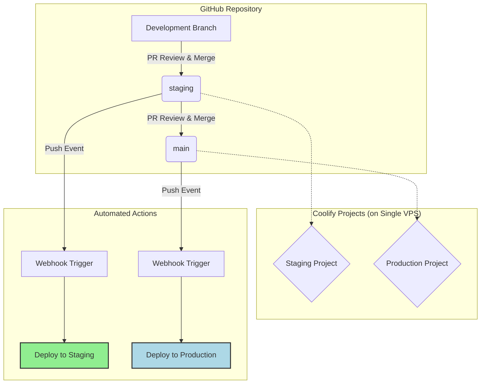

# FastAPI Deployment Plan

- **Project:** FastAPI Application
- **Platform:** Coolify Cloud + Single VPS
- **VCS:** GitHub
- **Date:** August 21, 2025
- **Version:** 1.11.0

## Overview

This document outlines the standardized CI/CD workflow for deploying the FastAPI application to Staging and Production environments. The plan leverages a Git branch-based strategy to automate deployments, ensure environment isolation, and maintain a stable production service.

## 2.0 Core Principles

- **Git as the Source of Truth (GitOps):** The state of our environments is defined by the code in our Git branches. All deployments are triggered by Git events.
- **Environment Isolation:** Staging and Production environments, including their databases and configurations, are completely separate to prevent cross-contamination.
- **Automation:** All deployments to both environments are fully automated upon merging code, reducing manual effort and the risk of human error.
- **Code Promotion:** Code flows in one direction: from a development branch, to staging for testing, and finally to main for production release.

## 3.0 Workflow Diagram

This diagram illustrates the flow of code from a developer's machine to the production server.



## 4.0 GitHub Repository Setup

### 4.1 Branching Strategy

- **`main`**: Represents the stable, production-ready codebase. Direct commits are forbidden.
- **`staging`**: A pre-production branch for integration testing and QA. This branch should be kept stable and deployable to the staging environment at all times.
- **Development Branches**: Developers create these short-lived branches from `main` to work on new features or bug fixes. There is no strict naming convention (e.g., `new-user-auth`, `fix-login-bug`).

### 4.2 Branch Protection Rules

The following rules must be configured in the repository settings (`Settings > Branches`).

**For the `main` branch:**

- ✅ **Require a pull request before merging:** Enforces a review process.
- ✅ **Require 1 approval:** Ensures a second pair of eyes reviews all code destined for production.
- ✅ **Dismiss stale pull request approvals when new commits are pushed:** Guarantees approvals are for the latest code.
- ✅ **Do not allow force pushes.**

**For the `staging` branch (Recommended):**

- ✅ **Require a pull request before merging:** Keeps the staging branch history clean and ensures features are intentionally promoted for testing.

## 5.0 Deployment Workflow in Practice

1.  **Develop:** A developer creates a new branch (e.g., `new-endpoint`) from `main`.
2.  **Submit for Staging:** The developer opens a Pull Request from their development branch to `staging`.
3.  **Deploy to Staging:** Once the PR is approved and merged, Coolify automatically detects the push to `staging` and deploys the new version to `staging-api.yourdomain.com`.
4.  **QA & Testing:** The team validates the changes in the staging environment.
5.  **Submit for Production:** A new Pull Request is opened from `staging` to `main`.
6.  **Deploy to Production:** After final review and approval, the PR is merged. Coolify detects the push to `main` and deploys the tested code to `api.yourdomain.com`.

## 6.0 Versioning Strategy

- **Commit Hash (Automatic):** Every deployment is intrinsically versioned by the Git commit hash (e.g., `a1b2c3d`). This is visible in the Coolify deployment logs and provides precise, auditable tracking.
- **Git Tags (Manual Milestones):** For significant releases, manually create a Git tag to mark the version.

```bash
git checkout main
git pull
git tag v1.2.0
git push origin v1.2.0
```
