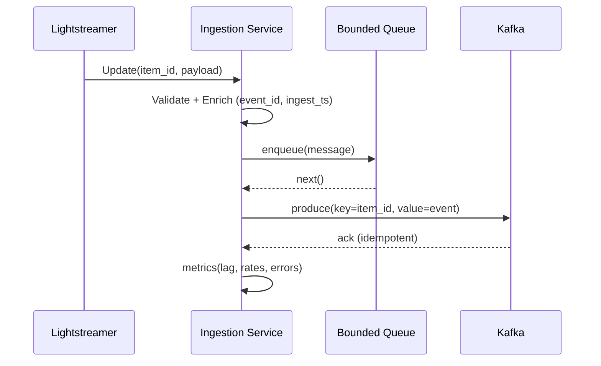

### 1. Overview

**1.1. Introduction**

This document defines the simplest viable architecture for the Ingestion Service as a single microservice with modular internal components. It connects to the ISS Lightstreamer ISSLIVE feed, validates and enriches telemetry, and publishes events to the message bus. It optimizes for time-to-value, cost, and maintainability while meeting current requirements. The broader ISS Telemetry Data Analytics System follows a microservices architecture; this document covers only the Ingestion Service and Message Bus.

**1.2. Business Goals**

- Reliable ingestion with strict per-item ordering and no duplicates.
- Enable near-real-time analytics (e.g., Pee-Bot) by delivering validated events to the bus.
- Provide observability (health, metrics) and stability (backpressure, retries, circuit breaker).
- Support replayability and retention via the bus.

**1.3. Technical Goals & Non-Goals**

- Technical goals:
  - Maintain persistent Lightstreamer subscription; handle reconnects.
  - Validate payloads; enrich with deterministic `event_id` and `ingest_ts`.
  - Non-blocking pipeline with bounded concurrency to sustain target throughput.
  - Idempotent, ordered publish to Kafka with per-item keys.
  - Expose `/healthz`, `/metrics`, and a protected test-ingest endpoint.
- Non-goals (out of scope now):
  - Stream processing/analytics, dashboards, ML/forecasting.
  - Schema registry rollout and governance beyond basic versioning.
- Multi-region HA; Kubernetes; multi-service decomposition of the Ingestion Service.


### 2. Proposed Technology Stack

2.1. **Frontend**

- None for this service.

2.2. **Backend**

- Python 3.11, FastAPI, Uvicorn (ASGI), asyncio
- Pydantic v2 for schema validation
- Lightstreamer Python client (official SDK)
- Tenacity for retries with jitter

Justification: Python/FastAPI aligns with team skills and speed of delivery; Pydantic enables strict validation; Lightstreamer SDK provides a stable client. Runtime pinned to Python 3.11 for dependency wheel availability and stability; revisit 3.13 once all dependencies publish official wheels and CI passes.

2.3. **Database**

- None. The service is stateless; no persistent store required.

2.4. **Real-time Communication**

- Not applicable for external clients. Internal ingestion uses Lightstreamer SDK.

2.5. **Message Bus Producer**

- `confluent-kafka-python` (librdkafka) in a producer thread pool for throughput and idempotent delivery; Kafka-compatible (Redpanda on local VPS).

Justification: High-performance producer with idempotence; widely adopted; minimizes risk.

2.6. **Message Bus (Broker)**

- Redpanda (Kafka API-compatible) single-node broker on the same VPS.

Justification: Simpler single-binary deployment (no JVM/KRaft complexity), lower resource footprint, faster startup, and zero additional cost while retaining Kafka API compatibility. Appropriate for a personal, single-node VPS deployment; switching to OSS Kafka later does not require app code changes.

2.7. **Testing**

- pytest, pytest-asyncio, httpx TestClient, freezegun for time-based tests.

2.8. **DevOps & Deployment**

- Containerized with multi-stage Docker build optimized for monorepo workspace structure.
- Deployed to Coolify-managed VPS with direct Git-based deployment (no registry required).
- CI/CD: GitHub Actions with comprehensive testing, linting, and automated deployment via webhooks.
- Container: FastAPI with Uvicorn, non-root execution, health checks, and automatic SSL via Let's Encrypt.
- Environments: staging and production with identical containers, environment-based configuration.
- Build System: uv package manager with workspace support for shared library dependencies.

Justifications summary: Single microservice with modular internal components; minimal infra. Kafka API explicitly required; use self-hosted Redpanda (Kafka-compatible) on the same VPS to avoid extra cost; Docker-on-VPS keeps ops simple.


### 3. System Architecture

**3.1. High-Level Diagram**

```mermaid
flowchart LR
  subgraph External
    LS[Lightstreamer ISSLIVE Adapter]
  end

  subgraph IngestionService["Ingestion Service"]
    A[Lightstreamer Subscriber]
    B[Validator and Enricher]
    Q[Async Queue]
    P[Kafka Producer]
    H[HTTP API]
  end

  subgraph Platform["Platform on single VPS"]
    K[Kafka/Redpanda (self-hosted)]
    M[Metrics Collector]
  end

  LS --> A --> B --> Q --> P --> K
  H --> B
  IngestionService --> M
```

**3.2. Component Breakdown**

- Lightstreamer Subscriber: Maintains subscription; resumes on disconnect; translates updates to normalized dicts.
- Validator & Enricher: Pydantic models enforce schema; adds `event_id` (deterministic hash) and `ingest_ts`.
- Async Queue: Bounded `asyncio.Queue` decouples intake from publish; enables backpressure.
- Kafka Producer: Threaded `confluent-kafka` producer with idempotence and per-item key to preserve partition ordering; batched flush.
- HTTP API: `/api/v1/ingest/test` for controlled test injection; `/healthz` liveness; `/metrics` Prometheus.


### 4. Data Design

**4.1. Data Models**

Pydantic model (logical schema for produced events):

```python
from pydantic import BaseModel, Field, AwareDatetime
from typing import Optional

class TelemetryEvent(BaseModel):
    schema_version: int = Field(1, ge=1)
    event_id: str  # deterministic SHA-256 of key fields
    item_id: str = Field(min_length=1)
    source_ts: AwareDatetime  # from Lightstreamer payload
    ingest_ts: AwareDatetime  # set by ingestion service
    value: str  # raw value as string to avoid precision loss
    status_class: Optional[str]
    status_indicator: Optional[str]
    status_color: Optional[str]
    calibrated_data: Optional[str]
    source: str = Field("isslive", const=True)
```

Constraints and indexes:
- Kafka key: `item_id` (strict ordering per telemetry item).
- Deterministic `event_id`: SHA-256 of `item_id|source_ts|value|status_class|status_indicator|status_color|calibrated_data|schema_version` to enable downstream idempotency.
- No database indexes (service is stateless).

Topic conventions:
- Topic name: `telemetry.raw.v1`
- Partitions: sized by number of distinct `item_id` keys and throughput; start with 12 and adjust.
- Retention (hot): 7 days (broker setting on local Redpanda). Compaction disabled for this raw topic.

**4.2. Data Flow Diagram**




### 5. API and Interface Definitions

REST (internal/admin only):

- HTTP Method: `POST`
- Endpoint URL: `/api/v1/ingest/test`
- Request (JSON):

```json
{
  "item_id": "USLAB000061",
  "source_ts": "2025-01-01T12:00:00Z",
  "value": "12.34",
  "status_class": "OK",
  "status_indicator": "NOMINAL",
  "status_color": "GREEN",
  "calibrated_data": "12.34 C"
}
```

- Response (201 Created):

```json
{ "event_id": "5f7c...", "status": "enqueued" }
```

- Status Codes:
  - 201: Accepted/enqueued
  - 400: Validation error
  - 401/403: Unauthorized/Forbidden (missing/invalid token)
  - 429: Queue full (backpressure active)
  - 500: Internal error

Operational endpoints:
- `GET /healthz` -> 200 OK with basic process health
- `GET /metrics` -> Prometheus exposition format


### 6. Cross-Cutting Concerns

**6.1. Authentication & Authorization**

- Test endpoint protected by static Bearer token configured via environment variable; enforced via FastAPI dependency.
- Principle of least privilege for deployment runtime; no public exposure unless IP-restricted.

**6.2. Security Considerations**

**Current Implementation**: ✅ **Operational Security Measures**
- **TLS/HTTPS**: Automatic SSL certificate provisioning via Let's Encrypt with HTTP-to-HTTPS redirect
- **Container Security**: Non-root execution (appuser:appgroup), resource limits, minimal attack surface
- **Build Security**: Multi-stage Docker build, vulnerability scanning with bandit, no secrets in images
- **Secret Management**: Environment variables managed via Coolify, runtime secret injection
- **Network Security**: Traefik reverse proxy with SSL termination, internal service communication

**Additional Security Measures**:
- Kafka/Redpanda runs locally on the same VPS; keep broker bound to localhost. If remote clients are introduced later, enable SASL/SSL.
- Strict input validation with Pydantic schemas; reject malformed data; capped payload sizes; timeouts on external calls.
- Pre-commit hooks for security scanning, code formatting, and vulnerability detection.
- Automated security updates via CI/CD pipeline with bandit security linting.

**6.3. Logging and Monitoring**

- Structured JSON logs to stdout (INFO default; DEBUG toggleable).
- Prometheus metrics: ingestion rate, queue depth, processing latency, publish success/failures, retries, Lightstreamer reconnects. Surface Kafka client metrics if available (e.g., delivery latency, error counts).
- Optional: Sentry DSN for error reporting.


### 7. Non-Functional Requirements (NFRs)

- Scalability: Non-blocking pipeline with bounded concurrency; for now, single-replica on one VPS. Future scale: add a second VPS or migrate broker to managed service.
- Performance: Target now ~70 msg/s; design for 10k msg/s with idempotent producer and batching; P99 ingestion-to-produce < 200 ms.
- Reliability: Idempotent producer; deterministic `event_id`; retries with jitter; bounded queues; circuit breaker on Lightstreamer disconnects. Single-node Redpanda is a SPOF; acceptable for personal project. Back up data dir or accept data loss on node failure.
- Maintainability: Small, typed codebase; single container; clear module boundaries (subscriber, validator, publisher, API).


### 8. Deployment and Infrastructure

**Current Implementation Status**: ✅ **Deployed and Operational**

Production deployment:
- **Container**: Multi-stage Docker build with Python 3.11, FastAPI, and Uvicorn running on port 8000
- **Platform**: Coolify Cloud control plane managing deployment to dedicated Hetzner VPS via SSH
- **SSL**: Automatic Let's Encrypt certificate provisioning with direct traffic routing to VPS
- **Health Monitoring**: `/healthz` endpoint with 30-second intervals and automatic container restart
- **Security**: Non-root container execution (appuser:appgroup), resource limits, and HTTPS-only access
- **Build System**: uv workspace dependency management with monorepo shared library support
- **CI/CD**: GitHub Actions pipeline with automated testing, linting, security scanning, and webhook deployment

**Deployment Configuration**:
- Base Directory: `/` (repository root for monorepo workspace access)
- Dockerfile Location: `services/ingestion/Dockerfile`
- Build Command: `uv sync --frozen --no-dev --all-packages` (installs workspace dependencies)
- Environment: Staging environment operational, production-ready configuration available
- SSL: Automatic HTTPS with Let's Encrypt certificate management and HTTP redirect

**Pending Infrastructure Components**:
- Self-hosted Redpanda (Kafka-compatible) message broker deployment
- Inter-service communication setup for message bus integration
- Prometheus/Grafana monitoring stack deployment
- Production environment promotion and testing

Cost and ops impact (rough order-of-magnitude, monthly):
- Hetzner VPS (Coolify host): sunk cost (existing VPS). Complexity: low-to-medium; ops owned by you (VM, Docker, backups).
- Redpanda single-node: no additional cost; complexity: medium (storage, retention, disk space monitoring); ops owned by you.
- Monitoring: run Prometheus/Grafana as containers on VPS (no extra cost); complexity: medium; ops owned by you.
- Sentry (optional): free tier; complexity: low; SaaS ops.

Operational playbook highlights:
- Rollouts: restart ingestion first, then broker only during maintenance windows; ensure broker data volume is backed up or disposable if acceptable.
- Config via env: broker bootstrap (localhost), topic, partitions, auth token, metrics flags.
- Alarms: queue depth high-watermark, publish failures, broker disk usage >80%, broker restarts, Lightstreamer reconnect churn.


### 9. Assumptions and Gaps

Assumptions:
- Access to Lightstreamer ISSLIVE and item list will be provided.
- A single Hetzner VPS hosts Coolify, the Ingestion Service, and Redpanda. Local-only broker access (localhost) is sufficient.
- Topic retention (hot) is set to 7 days on the local broker.

Open questions (targeted):
- Confirm preferred Redpanda version and data directory size on disk; acceptable disk usage ceiling.
- Provide authoritative list of Lightstreamer items and field mapping nuances (units, bounds).
- Confirm metrics collection standard and alert thresholds.
- Confirm TLS termination location and any IP allowlists for the test endpoint (if exposed beyond localhost).


### 10. Implementation Notes (non-binding)

- Use a bounded `asyncio.Queue` (e.g., size 10_000) between validation and publish; when full, return 429 on test endpoint and temporarily drop ingestion reads by pausing the subscriber.
- Configure producer with idempotence enabled, linger.ms/batch.num.messages tuned for throughput, and delivery callbacks to track acks.
- Compute deterministic `event_id` with SHA-256 over canonicalized fields; ensure stable serialization to avoid accidental changes.
- Per-item keying preserves strict ordering; partition count sized to keys and throughput.


### 11. Message Bus (Redpanda) Configuration & Ops

Profile
- Single-node Redpanda (Kafka-compatible) container on the same Hetzner VPS as Ingestion.
- Bind Kafka API to localhost only; expose Prometheus metrics port to localhost.
- Data directory: `/var/lib/redpanda/data` (mounted Docker volume). Retention: 7 days.

Topics
- `telemetry.raw.v1`: key=`item_id`, value=`TelemetryEvent` JSON, partitions=12 (adjust empirically), replication factor=1, cleanup.policy=`delete`, retention.ms=`604800000` (7 days).
- Naming/versioning: `domain.resource.v{n}`; breaking schema changes require a new versioned topic.

Producer settings (confluent-kafka)
- `enable.idempotence=true`, `acks=all`, `delivery.timeout.ms=120000`, `request.timeout.ms=30000`, `max.in.flight.requests.per.connection=5`.
- `linger.ms=5..20`, `batch.num.messages=1000..10000` (tune), `compression.type=snappy` or `lz4`.
- Keying: `item_id` for strict per-item ordering.

Ordering & idempotency policy
- Ordering guaranteed per partition via keying by `item_id`.
- Deterministic `event_id` computed by ingestion allows downstream idempotent processing and dedup.

Disk sizing & monitoring
- Capacity estimate: `avg_msg_bytes × messages_per_second × seconds(7d)` with RF=1.
- Example: 500 B × 70 msg/s × 604800 ≈ 21 GB; add 30–50% headroom. For 10k msg/s design test, disk would be prohibitive on single VPS; keep as future scalability note.
- Alerts: warn at 80% disk; rotate/remove old segments by retention; monitor partition sizes and broker restarts.

Operations
- Startup order: Redpanda -> Ingestion.
- Shutdown order: Ingestion -> Redpanda. Ensure producer flush on SIGTERM.
- Backup: optional. If desired, stop broker, snapshot data dir. Otherwise accept data loss on node failure.
- Upgrade: stop ingestion, stop broker, back up data dir, upgrade container image, start broker, start ingestion.

Security
- Localhost-only Kafka API; no SASL/SSL initially. If remote clients are needed later, enable SASL/SSL and firewall allowlists.
- Restrict Coolify routes; keep test-ingest endpoint non-public or IP-allowlisted.

Observability
- Enable Redpanda metrics and scrape with local Prometheus; Grafana dashboards for produce/consume rates, partition health, storage, restarts.
