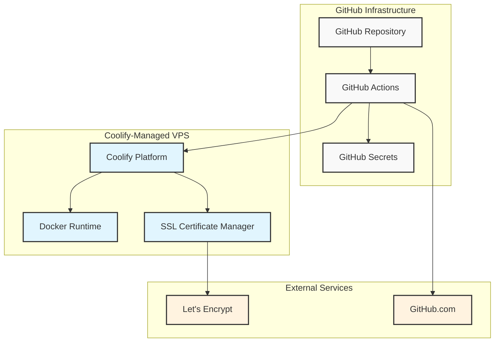
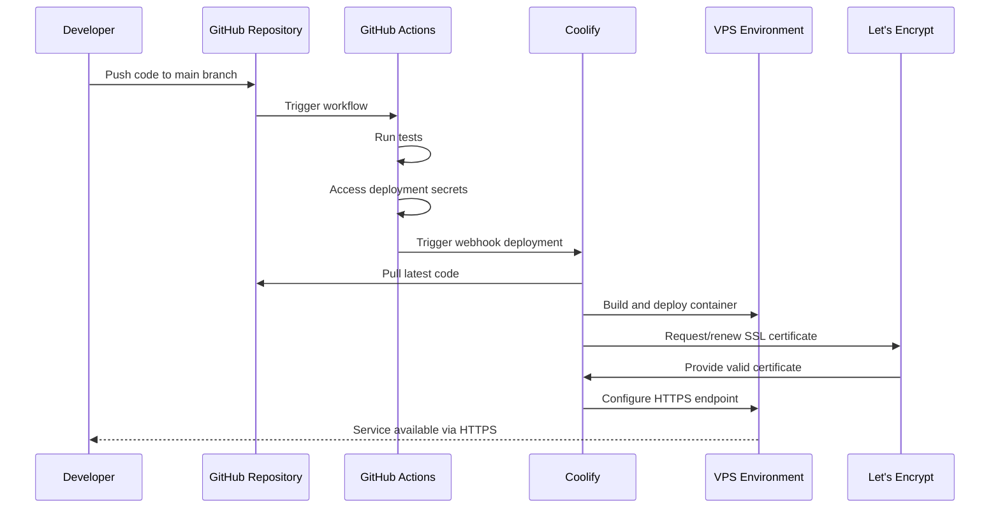

# Technical Design Document
## T002 - Prepare Access, Repositories, and Environment

# Overview

This technical design establishes the foundational infrastructure, access controls, and repository setup necessary for developing and deploying the ISS Telemetry Data Analytics System's Ingestion Service. The approach prioritizes simplicity, security, and direct Git deployment through Coolify with automatic SSL management, avoiding unnecessary complexity while ensuring proper access controls and CI/CD automation.

The design implements a streamlined DevOps workflow where GitHub Actions runs tests and triggers direct Git-based deployment to a Coolify-managed VPS, eliminating container registry dependencies and reducing operational overhead while maintaining security through proper access controls and automatic HTTPS certificate management.

# Architecture

## Component Hierarchy

## Data Flow

# Components and Interfaces

## GitHub Repository Component

**Purpose & Responsibilities**: Serves as the central source code repository with proper access controls, branch protection, and collaboration settings. Maintains version control, enforces code review requirements, and provides the foundation for automated CI/CD workflows.

**Props**: 
- Repository name: `iss-data-analytics-system`
- Visibility: Public (per user preference)
- Default branch: `main` with protection rules
- Branch protection: Require PR reviews, status checks
- Collaboration permissions: Single-user repository configuration

**Side effects**: 
- Repository creation and configuration via GitHub API
- Branch protection rule enforcement
- Webhook configuration for CI/CD integration
- Single-user access configuration

**Data Fetching Strategy**: Not applicable - static configuration

**Integration Pattern**: Direct integration with GitHub Actions and Coolify via webhooks

**Dependencies**: GitHub account access

### User Interface Design

#### Layout Structure
**Desktop Layout**: Standard GitHub repository interface with custom README and documentation structure
**Tablet Layout**: Responsive GitHub web interface
**Mobile Layout**: GitHub mobile app compatibility

#### Design Specifications
**Structure**: Standard GitHub repository layout with organized folder structure following service-based architecture
**Visual States**: Active repository with proper README, documentation, and clear contribution guidelines

### Error Handling

#### Error Recovery
- Repository access failures: Verify permissions and account access
- Branch protection bypass attempts: Enforce through GitHub settings
- Unauthorized access: Audit logs and access review procedures

## GitHub Actions CI/CD Component

**Purpose & Responsibilities**: Provides automated testing, building, and deployment pipeline. Executes on code push events, runs test suites, and triggers deployment to Coolify-managed infrastructure through secure webhook integration.

**Props**:
- Trigger events: `push` to main branch, `pull_request` for validation
- Runtime environment: `ubuntu-latest`
- Node.js version: LTS for compatibility
- Docker buildx support for multi-platform builds

**Side effects**:
- Test execution and reporting
- Build artifact generation
- Coolify webhook trigger with authentication
- Status reporting back to GitHub

**Data Fetching Strategy**: Accesses GitHub Secrets for deployment credentials, fetches source code via checkout action

**Integration Pattern**: Event-driven workflow triggered by Git events, direct API integration with Coolify

**Dependencies**: GitHub Secrets (COOLIFY_WEBHOOK, COOLIFY_TOKEN), Docker runtime, test frameworks

### User Interface Design

#### Layout Structure
**Desktop Layout**: GitHub Actions tab showing workflow runs, logs, and status
**Tablet Layout**: Responsive GitHub Actions interface
**Mobile Layout**: GitHub mobile app workflow status

#### Design Specifications
**Structure**: Workflow files in `.github/workflows/` directory with clear naming and documentation
**Visual States**: Success/failure status indicators, detailed logs, deployment status reporting

### Error Handling

#### Error Recovery
- Test failures: Fail deployment, require fixes before merge
- Secret access issues: Verify secret configuration and permissions
- Webhook failures: Retry mechanism with exponential backoff
- Build failures: Clear error reporting and debugging information

## Coolify Platform Component

**Purpose & Responsibilities**: Manages container orchestration, SSL certificate automation, and service deployment on the VPS. Provides direct Git integration for builds, automatic HTTPS configuration, and service health monitoring.

**Props**:
- Git repository URL and branch configuration
- Build method: Nixpacks or Dockerfile detection
- SSL provider: Let's Encrypt integration
- Service type: Web application with health checks

**Side effects**:
- Container building and deployment
- SSL certificate provisioning and renewal
- HTTPS redirect configuration
- Service health monitoring and restart

**Data Fetching Strategy**: Pulls source code directly from GitHub, monitors deployment status

**Integration Pattern**: Webhook-based deployment triggers, Git-based build process

**Dependencies**: VPS Docker runtime, Let's Encrypt API, GitHub repository access

### User Interface Design

#### Layout Structure
**Desktop Layout**: Coolify dashboard with project management, deployment logs, and service status
**Tablet Layout**: Responsive Coolify interface optimized for tablet use
**Mobile Layout**: Mobile-friendly Coolify dashboard for monitoring

#### Design Specifications
**Structure**: Project-based organization with clear service configuration and status visibility
**Visual States**: Deployment status indicators, health check results, SSL certificate status

### Error Handling

#### Error Recovery
- Build failures: Detailed build logs and error reporting
- SSL certificate issues: Automatic retry with fallback to HTTP
- Service health failures: Automatic restart with alerting
- Git pull failures: Retry mechanism with manual intervention option

## VPS Environment Component

**Purpose & Responsibilities**: Provides the runtime environment for containerized services with Docker support, network configuration, and resource management. Ensures sufficient compute, memory, and storage resources for the ingestion service and message broker.

**Props**:
- Minimum specifications: 2 CPU cores, 4GB RAM, 50GB disk
- Docker version: 20.x or higher
- Network configuration: Inbound HTTPS, outbound HTTPS, localhost binding
- Storage: Persistent volumes for service data

**Side effects**:
- Container runtime management
- Resource allocation and monitoring
- Network traffic routing
- Disk space management

**Data Fetching Strategy**: System resource monitoring and reporting

**Integration Pattern**: Direct container deployment via Coolify management

**Dependencies**: Linux operating system, Docker runtime, network connectivity

### User Interface Design

#### Layout Structure
**Desktop Layout**: System monitoring dashboard accessible through Coolify
**Tablet Layout**: Responsive monitoring interface
**Mobile Layout**: Essential monitoring metrics for mobile access

#### Design Specifications
**Structure**: Resource utilization graphs, container status, and system health indicators
**Visual States**: Resource usage alerts, container health status, network connectivity status

### Error Handling

#### Error Recovery
- Resource exhaustion: Automatic alerting and scaling recommendations
- Docker runtime issues: Service restart and health check validation
- Network connectivity problems: Diagnostic tools and manual intervention procedures
- Disk space issues: Cleanup procedures and storage expansion options

## SSL Certificate Management Component

**Purpose & Responsibilities**: Automates SSL certificate provisioning, renewal, and configuration through Let's Encrypt integration. Ensures all service endpoints are secured with valid HTTPS certificates without manual intervention.

**Props**:
- Certificate authority: Let's Encrypt
- Domain validation: HTTP-01 challenge
- Renewal schedule: Automatic 30 days before expiration
- Certificate format: Standard X.509 with RSA/ECDSA keys

**Side effects**:
- Certificate generation and installation
- HTTPS redirect configuration
- Certificate renewal automation
- Security header configuration

**Data Fetching Strategy**: Certificate status monitoring and expiration tracking

**Integration Pattern**: Integrated with Coolify platform for seamless automation

**Dependencies**: Let's Encrypt API, DNS/HTTP challenge capability, valid domain configuration

### User Interface Design

#### Layout Structure
**Desktop Layout**: Certificate status within Coolify service configuration
**Tablet Layout**: Certificate management interface
**Mobile Layout**: Certificate status indicators

#### Design Specifications
**Structure**: Certificate validity status, expiration dates, renewal history
**Visual States**: Valid/invalid certificate indicators, renewal status, error alerts

### Error Handling

#### Error Recovery
- Certificate generation failures: Retry with fallback challenge methods
- Renewal failures: Alert and manual intervention procedures
- Validation failures: DNS/HTTP challenge debugging
- Let's Encrypt API issues: Retry with exponential backoff

# Testing Strategy

## Unit Tests

**GitHub Actions Workflow Validation**:
- Workflow syntax validation using `actionlint`
- Secret reference validation
- Job dependency verification
- Environment variable validation

**Coolify Configuration Tests**:
- Service configuration validation
- SSL certificate configuration testing
- Health check endpoint validation
- Resource allocation verification

## Integration Tests

**CI/CD Pipeline Integration**:
- End-to-end workflow execution from code push to deployment
- Secret access and webhook trigger validation
- Build and deployment success verification
- Service availability after deployment

**SSL Certificate Integration**:
- Certificate provisioning workflow testing
- HTTPS redirect functionality verification
- Certificate renewal simulation
- Security header validation

## End-to-End Tests

**User Workflows**:

1. **Developer Code Push Workflow**:
   - Developer pushes code to main branch
   - GitHub Actions triggers automatically
   - Tests execute successfully
   - Deployment webhook triggers
   - Service deploys with HTTPS enabled
   - Service becomes available with valid SSL certificate

2. **Repository Setup Workflow**:
   - Repository creation with proper settings
   - Team access configuration
   - Branch protection rule application
   - CI/CD secret configuration
   - First successful deployment

3. **Access Control Workflow**:
   - Authorized access verification
   - Unauthorized access prevention
   - Secret masking in logs
   - Audit trail generation

## Performance Considerations

**Optimization Strategies**:
- GitHub Actions workflow caching for dependencies
- Docker layer caching for faster builds
- Parallel job execution where possible
- Efficient secret access patterns

**High-Volume Performance**:
- Workflow execution time optimization (target: <2 minutes)
- Build process optimization for quick iterations
- Resource-efficient container builds
- Minimal deployment downtime

**Monitoring**:
- GitHub Actions execution time tracking
- Deployment success rate monitoring
- SSL certificate renewal success tracking
- VPS resource utilization monitoring

# Implementation Notes

## Technology Integration

**GitHub Actions Integration**:
- Use official GitHub actions where possible
- Implement proper error handling and retry logic
- Follow GitHub Actions security best practices
- Use workflow templates for consistency

**Coolify Integration**:
- Configure webhook authentication properly
- Implement proper Git branch tracking
- Use environment-specific configurations
- Enable health check monitoring

**Let's Encrypt Integration**:
- Configure automatic renewal schedules
- Implement proper challenge methods
- Monitor certificate expiration
- Plan for certificate authority failover

## Accessibility Considerations

**Repository Access**:
- Clear documentation for all access procedures
- Multiple authentication methods where possible
- Accessible documentation format
- Screen reader compatible interfaces

**Monitoring Interfaces**:
- High contrast status indicators
- Clear textual descriptions of visual elements
- Keyboard navigation support
- Mobile accessibility compliance

## Browser Compatibility

**Dashboard Access**:
- Modern browser support (Chrome 90+, Firefox 88+, Safari 14+)
- Progressive enhancement for older browsers
- Responsive design for all screen sizes
- Cross-platform compatibility verification

**Mobile Support**:
- Native mobile app compatibility where available
- Progressive web app features
- Touch-friendly interface elements
- Offline capability for critical monitoring features